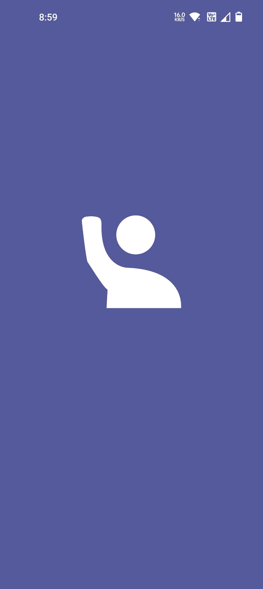
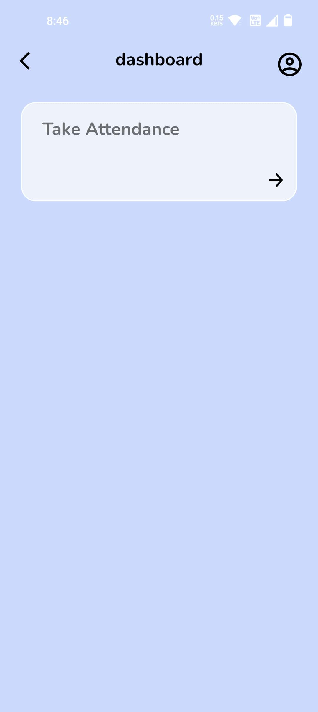
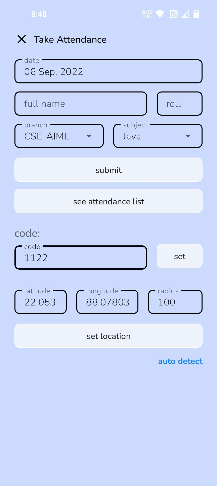
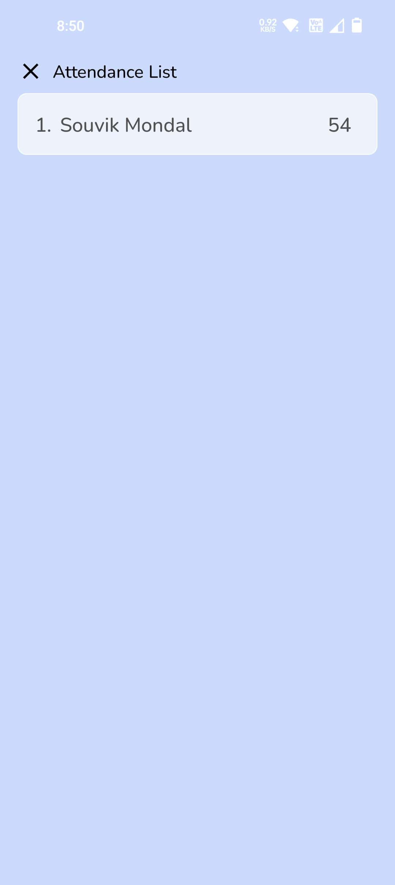
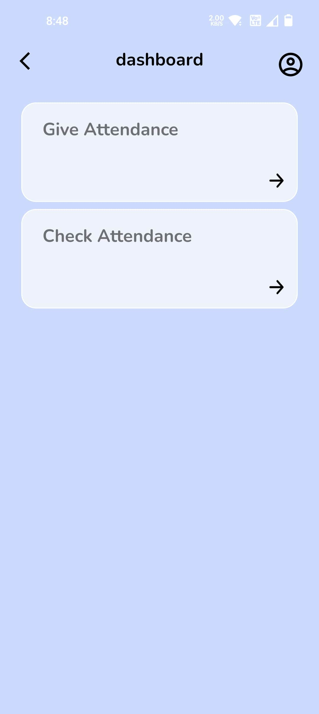
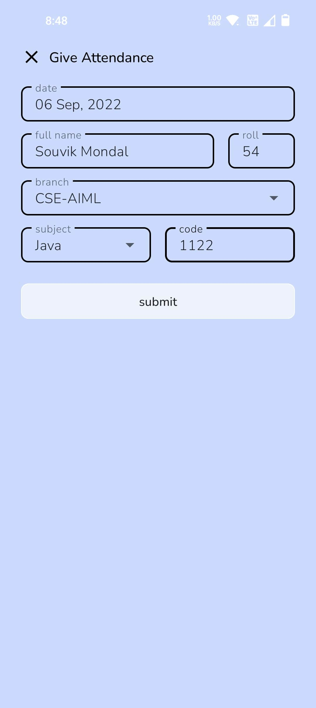
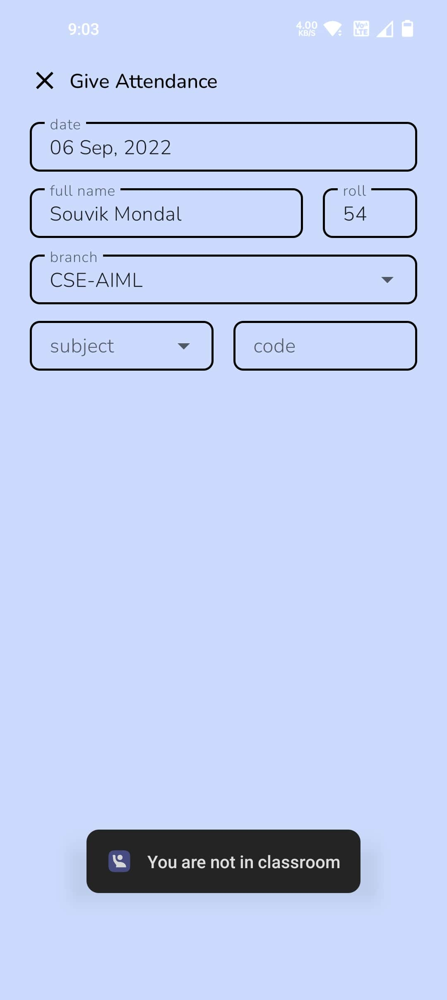

# I'm Present-Android

## Built With 🛠
* [Kotlin] - First class and official programming language for Android development.
* [Material Components for Android] - Modular and customizable Material Design UI components for Android.
* [Firebase] - is a platform developed by Google for creating mobile and web applications. 
* [Fused Location Provider] - is a location API in Google Play services.
## App Icon 📱

## Some Screenshots

**Teacher Section :**

**Student Section :**

[Kotlin]: https://kotlinlang.org/
[Material Components for Android]: https://github.com/material-components/material-components-android
[Firebase]: https://firebase.google.com/
[Fused Location Provider]: https://developers.google.com/location-context/fused-location-provider
